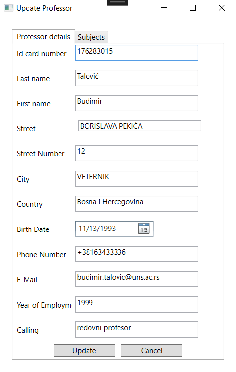

# Student Services

Visoko ocenjeni akademski projekat iz predmeta Osnove informacionih sistema i softverskog inženjerstva na Fakultetu tehničkih nauka. Aplikacija **Student Services** omogućava administratorima, odnosno studentskoj službi, efikasno praćenje studenata, profesora, predmeta i departmana.

## Autori

- **Teodora Bečejac, RA 37/2021**
- **Nataša Radmilović, RA 20/2021**

## O Projektu

Aplikacija **Student Services** je razvijena u C# jeziku prateći MVC (Model-View-Controller) pattern. Aplikacija podržava dva jezika, srpski i engleski, između kojih se može lako prelaziti.

Za detaljne informacije o funkcionalnostima, molimo vas da pogledate dokumentaciju [OISISI Specifikacija projekta 2023_2024.pdf](OISISI%20Specifikacija%20projekta%202023_2024.pdf) koja se nalazi unutar projekta.

### Struktura Projekta
Aplikacija je podeljena na dva dela: GUI (grafički korisnički interfejs) i CLI (komandno-linijski interfejs).

#### CLI Deo
- **Console**: Sadrži glavnu logiku za rad u komandno-linijskom interfejsu.
- **Controller**: Sadrži kontrolere koji upravljaju tokovima podataka između modela i prikaza.
- **DAO**: Sadrži Data Access Object klase za pristup podacima.
- **Data**: Sadrži statičke podatke aplikacije.
- **Model**: Sadrži modele koji predstavljaju podatke aplikacije.
- **Observer**: Implementacija observer paterna.
- **Storage**: Sadrži logiku za skladištenje podataka.

#### GUI Deo
- **DTO**: Sadrži Data Transfer Objecte.
- **Data**: Sadrži statičke podatke aplikacije.
- **Enums**: Sadrži enumeracije koje se koriste u aplikaciji.
- **Icons**: Sadrži ikone korišćene u aplikaciji.
- **Localization**: Sadrži resurse za lokalizaciju aplikacije.
- **Properties**: Sadrži konfiguracione fajlove.
- **View**: Sadrži prikaze koji korisnicima prikazuju podatke.

## Funkcionalnosti aplikacije

Evo kratkog pregleda funkcionalnosti koje aplikacija **Student Services** pruža:

### Student
- **CRUD operacije nad studentima**: Pregled, dodavanje, izmena i brisanje studenata.
- **Prikaz položenih ispita**: Pregled položenih ispita za odabranog studenta, uključujući prosečnu ocenu i osvojene ESPB bodove.
- **Dodavanje predmeta studentu**: Dodavanje predmeta koje student pohađa.
- **Poništavanje ocene**

### Profesor
- **CRUD operacije nad profesorima**: Pregled, dodavanje, izmena i brisanje profesora.
- **Profesor predaje predmete**: Prikaz predmeta koje profesor predaje.
- **Dodavanje predmeta profesoru**: Dodavanje predmeta koje profesor predaje.
- **Uklanjanje predmeta sa profesora**: Uklanjanje predmeta koje profesor predaje.
- **Profesor studenti**: Pregled studenata koje profesor podučava.

### Predmet
- **CRUD operacije nad predmetima**: Pregled, dodavanje, izmena i brisanje predmeta.
- **Uklanjanje predmeta koji neki student pohađa**
- **Dodavanje profesora na predmet**
- **Uklanjanje profesora sa predmeta**

### Katedra
- **Postavljanje šefa katedre**:
- **Prikaz predmeta unutar katedre**

### Dodatne funkcionalnosti
- **Glavni prozor**: Centralni prozor aplikacije sa pregledom svih funkcionalnosti.
- **Menu bar i toolbar**: Alatne trake za brzi pristup funkcionalnostima.
- **Status bar**: Prikaz trenutnog statusa aplikacije.
- **Upis ocene**: Unos ocene za studenta.
- **Pretraga i sortiranje svih entiteta**
- **Prikazivanje studenata koji pohađaju višestruke predmete**
- **Prikazivanje studenata koji su položili jedan od izabranih predmeta, a drugi ne**

## Galerija Screenshotova Aplikacije

Ovde možete videti izgled glavnih delova aplikacije:

### Glavni prozor (Engleski)

### Glavni prozor (Srpski)

### Poređenje studenata 2 predmeta

### Izmena podataka profesora
Prateći principe konzistentnosti, slično su urađeni i ostali prozori za izmenu podataka.

